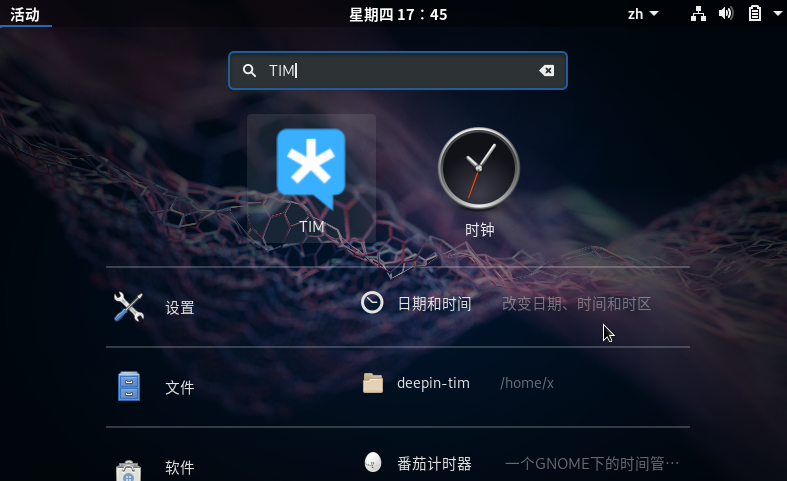
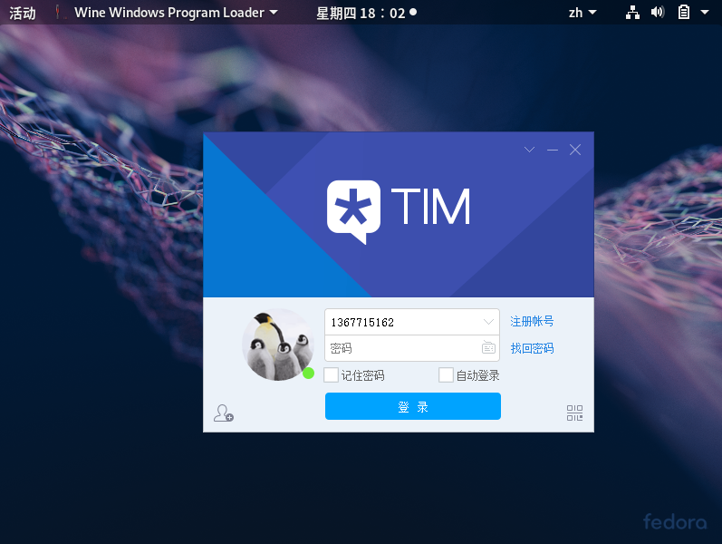
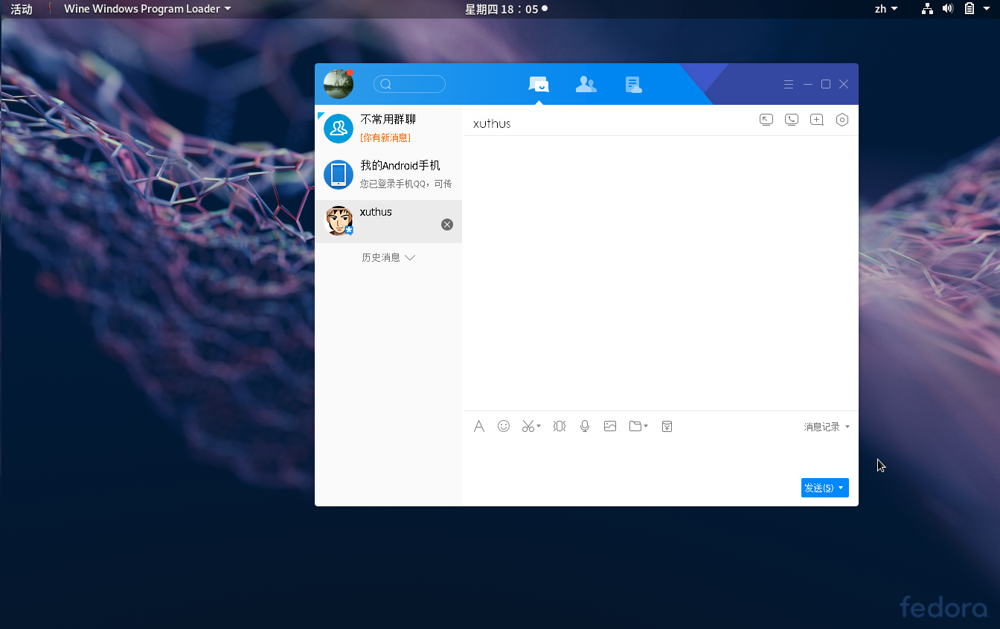

# Fedora--Deepin-TIM 一键安装脚本

该脚本测试于 Fedora-GNOME-29上。适应于GNOME系列桌面，不支持KDE。

## 如何使用

下载仓库

注意：该仓库接近123M，若github拉取速度慢，请使用gitee仓库

```
# 直接Github仓库下载
git clone https://github.com/xuthus5/fedora-deepin-tim.git

# 国内Gitee仓库
git clone https://gitee.com/xuthus5/fedora-deepin-tim.git
```

执行安装

```
cd fedora-deepin-tim

./install.sh
```

## 结果演示





若需要卸载，执行 uninstall.sh 脚本。可以干净清除

```
./uninstall.sh
```

方案参考：bilibili @[望深邃星空丶](https://space.bilibili.com/23259667)